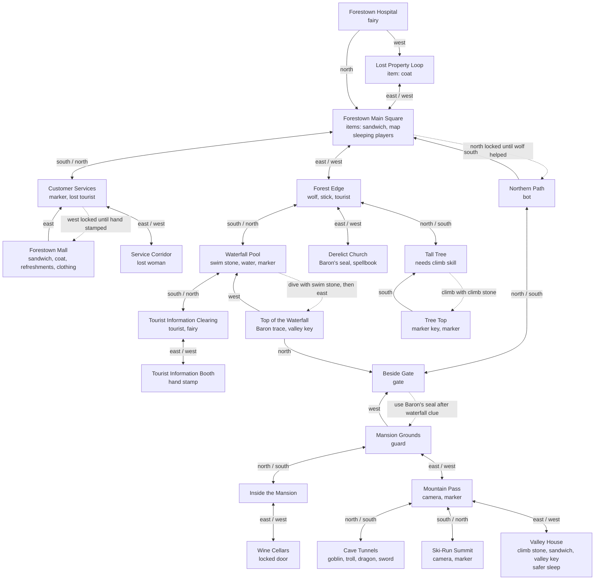

# Recreated iForest Game Map

This map reflects the current reconstructed Node game in `src/gameData.js`. Solid links are playable connections. Dotted labels mark evidence-led unlocks or inferred bridges where the original full room graph has not been recovered.

## Implemented Evidence Details

- **Wolf/fairy unlock:** examine the wolf at Forest Edge, then use the thorn to open the northern path.
- **Big-house chain:** take the Baron's seal from the church, dive at the waterfall with the swim stone, examine the Baron trace, then use the seal at the gate.
- **Skill stones:** swim is needed to dive in the pool; climb is needed to reach the tree top.
- **Mall stamp:** the mall guard blocks entry until the tourist information booth stamps your hand.
- **Markers:** marker keys can claim fixed game markers. The claim is tracked per room.
- **Magic:** reading a spellbook grants a permanent spell. The recovered evidence proves spellbooks and permanent spells, but not the exact spell list.
- **Sleeping:** sleep is modeled everywhere; Valley House and the recovered wooden house are treated as safer sleeping places because the help pages describe locked/safe rooms.
- **Hospital/lost property:** when strength falls to zero (recovered from `ifinfo3.wml`), the fairies carry the player to Forestown Hospital and carried items move to the Lost Property loop, which can be revisited via `west` to recover them.
- **Login disclaimer:** the recovered `ifdisc.wml` capture tells the player they need a name (visible to other players) and a password (do not reuse a real one), then a Start playing link to `/servlets/mfr`. `createGame({ login: true })` surfaces that disclaimer text and spawns the player straight into Forestown Main Square.
- **PvP combat note:** `ifinfo2.wml` describes auto-pick of the best held weapon and best held defence, dropping one carried item per hit. The single-player reconstruction surfaces this as flavor on `attack` rather than simulating other players.
- **Fairy housekeeping:** every eighth command resets the XML-like location documents, replacing taken objects and clearing dropped clutter.

## Still Unknown

The original Java source, XML location files, full world graph, exact combat formulas, exact spell effects, and complete post-mansion puzzle chain were not recovered. The current map is therefore a playable evidence-led reconstruction, not a claim that the original topology is complete.

An earlier version of this reconstruction wired in a reception lobby with a sceptical receptionist, a service-corridor lift to a giant's kitchen cage, a wooden house with an old woman in a rocking chair, and a `swap` verb to switch places between two characters. Those came from servlet captures of the **UseEverything** demo (`servlets/DriverHTML`, `servlets/Driver?code=beanstalk`, `Driver?c1=Peter&c2=Jane&c=swap`) and the WAP `other/intro.wml` / `intro2.wml` pages, which belong to UseEverything's two-character single-player game, not to iForest. Those captures have been relocated to `evidence/wayback/raw/useeverything/` and the corresponding rooms, the `swap` verb, the `sign` lift entry, and the receptionist-in-lobby flavor have been removed. iForest's actual entry is the `ifdisc.wml` disclaimer page linking to `/servlets/mfr` for login; the original Forestown map past that login point remains incompletely recovered.

The 2003 `whattodo.htm` routes players "east… one location past the 'You are now leaving Forestown' sign, then south as far as you can, then east" to reach the tourist information booth. The reconstruction goes town → forest-edge → south → pool → south → info-clearing → east → info-booth. The original may have had an intermediate boundary room between Forestown and the forest edge that we have not recovered.

`whattodo.htm` also says that if you sleep behind a locked door with the key, "after a while the fairies will put a duplicate key into the game, but you will be safe for a few hours." The reconstruction models the 8-command fairy housekeeping reset but does not yet simulate a separate timed duplicate-key respawn for locked-door safe sleep.

`clipping.htm` describes the Palm OS PQA's "Info" button as also reading mail from a post office. We surface the PQA character-status form via `fun=aboutchar`, but the post-office room itself was not in any recovered location WML and is not in the current map.

The `/servlets/mfr` capture shows that the original game required a real account: a uid of 3+ letters and a password of 5+ characters, with `new=true|false` toggling signup vs. login. The `state=…` token in every `/servlets/Driver` URL was a server-side session id. The reconstruction is single-player and stores no accounts, so login, password recovery, and multi-session presence are not modelled.

The 2001 `news.htm` changelog confirms a social-action menu reached by selecting "More..." after clicking another player's name, with preset friendlies like "Say hello" and "Smile" added in June 2001. The reconstruction is single-player, so the social menu surfaces only as flavor in `recoveredSystems` — the exact action list, animations, and response semantics were not recovered.

`news.htm` also lists the WAPJAG online WAP browser as a way to play iForest through a regular web page in August 2001. The `DriverHTML` servlet capture confirms an HTML-rendered driver existed. We do not have the WAPJAG gateway state, and the relationship between `DriverHTML` and the WAPJAG-hosted experience is not fully recovered.

The `/servlets/Intro1` WAP page splits the games into a multiplayer branch (iForest, at `wap.useeverything.com/other/if.wml`) and two single-player siblings (Vampire Country and UseEverything). The single-player siblings have separate WML trees and are out of scope for this reconstruction.
