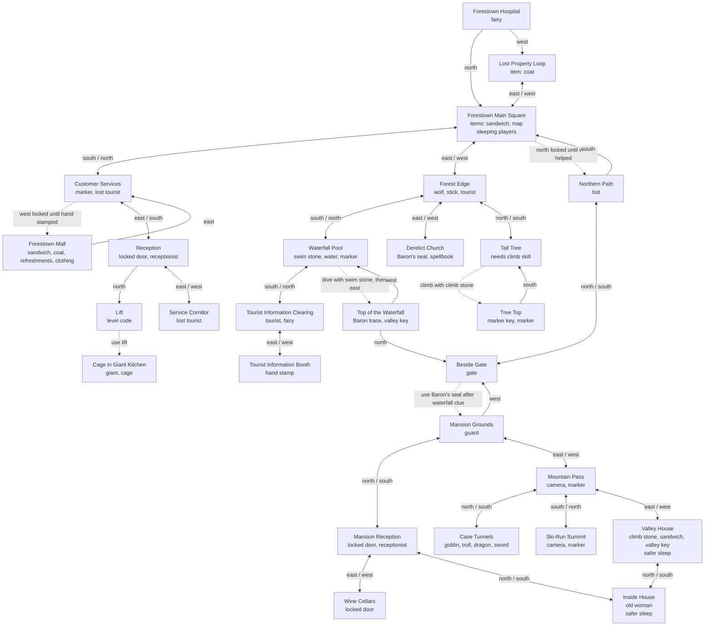

# Recreated iForest Game Map

This map reflects the current reconstructed Node game in `src/gameData.js`. Solid links are playable connections. Dotted labels mark evidence-led unlocks or inferred bridges where the original full room graph has not been recovered.

## Implemented Evidence Details

- **Wolf/fairy unlock:** examine the wolf at Forest Edge, then use the thorn to open the northern path.
- **Big-house chain:** take the Baron's seal from the church, dive at the waterfall with the swim stone, examine the Baron trace, then use the seal at the gate.
- **Skill stones:** swim is needed to dive in the pool; climb is needed to reach the tree top.
- **Mall stamp:** the mall guard blocks entry until the tourist information booth stamps your hand.
- **Markers:** marker keys can claim fixed game markers. The claim is tracked per room.
- **Magic:** reading a spellbook grants a permanent spell. The recovered evidence proves spellbooks and permanent spells, but not the exact spell list.
- **Sleeping:** sleep is modeled everywhere; Valley House and the recovered wooden house are treated as safer sleeping places because the help pages describe locked/safe rooms.
- **Hospital/lost property:** dangerous combat can send the player to hospital and move carried objects to Lost Property.
- **Fairy housekeeping:** every eighth command resets the XML-like location documents, replacing taken objects and clearing dropped clutter.
- **Recovered servlet states:** the gate, reception, lift, wooden house, and giant-kitchen cage use recovered WML/HTML room text where available. The cage's exact place in the larger graph is still unknown.

## Still Unknown

The original Java source, XML location files, full world graph, exact combat formulas, exact spell effects, and complete post-mansion puzzle chain were not recovered. The current map is therefore a playable evidence-led reconstruction, not a claim that the original topology is complete.
